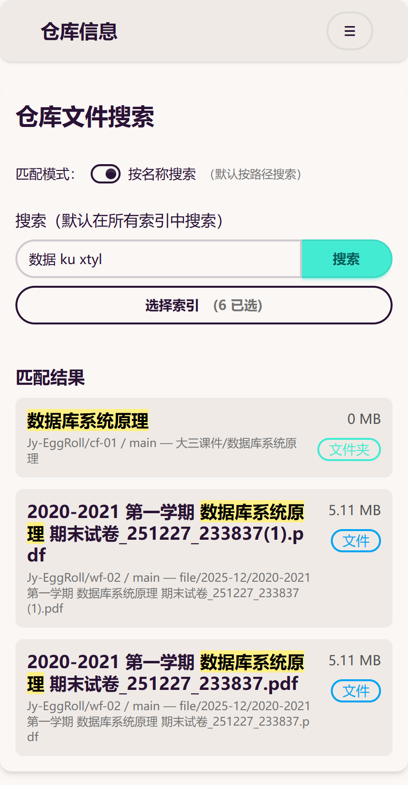
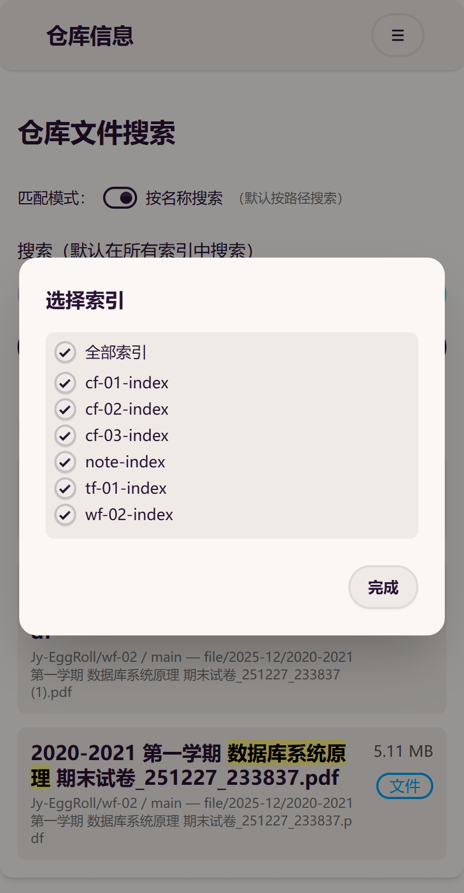
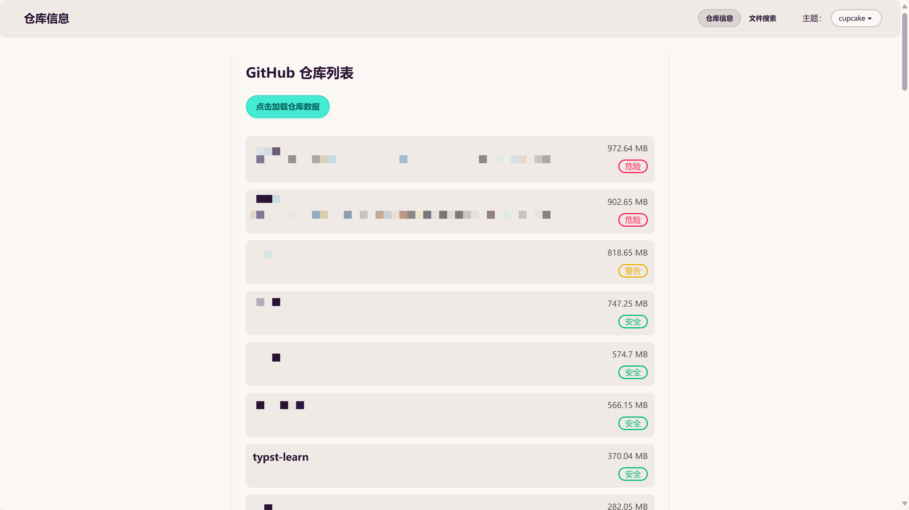

# RepoDex

命名：RepositoryIndex——仓库索引聚合。

## 为什么要开发此项目

在日常开发中，开发者在 GitHub 上建立了大量的仓库，其中有各种代码文件、文档资料、资源文件等。GitHub 本身缺少**跨仓库、跨分支的全局文件搜索能力**，这给开发者带来了诸多不便。

此外，对于中文用户，这些文件中不乏中文文件名的内容，GitHub 也不支持拼音模糊搜索，进一步限制了用户的检索效率。

为此，我开发了本项目，基于 GitHub Actions、Cloudflare Workers 和传统前端技术（当前，后期有向框架迁移的准备），实现了一套**跨仓库、跨分支的多维度模糊搜索系统**，以提升用户在 GitHub 上的文件检索效率。

本项目以**易配置、零成本**的思想开发，在正常使用情况下，**远不可能**达到 GitHub Actions 和 Cloudflare 的免费额度。您可以放心地按照本文流程部署项目，无须担心产生任何成本。

## 项目效果速览

### 移动端的优良适配

上图采用“按名称搜索”，您可以从中看出中英文、全拼、简拼的匹配效果。

本项目支持选择索引，默认全选。选中或取消选中后会在短暂的防抖延时后自动刷新结果列表。

### 美观的宽屏布局

对于仓库显示的标签，`>900MB` 是危险，`800~900MB` 是警告，`<800MB` 是安全。用户不应该存储大于 1GB 的仓库，这其中有很多原因，此处不再赘述。

### 其他特点

- 不论是仓库还是文件，都支持点击直达 GitHub。
- 文件默认检测所有分支（事实上，这是由索引决定的）
- 主题切换（当前仅支持手动，后续维护）

## 项目优点速览

- **拼音搜索与模糊搜索**：用户只需要记得文件名中的一些关键词，就可以模糊查找到任何文件。默认启用“以路径搜索”，即使用户的关键词没有体现在文件名本身中，只要用户的分类是合理的，即关键词体现在路径中，也可以搜索到文件。
- **高性能**：Cloudflare Workers 配合 Cloudflare KV，搜索速度很快。此外，受益于 Cloudflare 自身在全球的强大 CDN，网页本身的访问速度也并不慢。从 Cloudflare 向 GitHub 发起请求的速度也比较理想。
- **私密性极强**：本项目可接入任意私有仓库，搜索前端页面采用 HTTPS 加密鉴权（Hono 框架），只有同时获得 Cloudflare 机密中用户名与密码的用户，才可以访问（通常也就是用户自己）。若用户担心用户名与密码同时泄露，可以随意在 Cloudflare 后台更改。本项目直接保护网站的根路径，在未授权情况下无法访问任何 api 与页面资源，这甚至杜绝了被攻击的风险。

## 先决条件

用户只需要一个 Cloudflare 账号，不需要绑定银行卡等复杂操作。

## 如何使用该项目

### fork 本项目

### 在需要接入搜索的仓库配置的内容

#### Secrets（机密）

- `CF_API_TOKEN`：用于授权向 Cloudflare KV 推送数据。
- `CF_ACCOUNT_ID`：用于拼接推送时的链接。
- `CF_NAMESPACE_ID`：用于拼接推送时的链接。

#### 文件

- `.github/workflows/generate-index-and-push.yml`：自动化工作流配置文件，依赖上一步配置的机密。

### 在 Cloudflare Workers 上需要配置的内容

[TODO]

## 核心组件

### 文件索引生成器工作流

一套便于挂载到任何仓库的自动化工作流。

工作流的任务：

作为标准化挂件接入目标仓库后，当仓库**任意分支触发代码推送**，或通过**手动方式启动**时，即可执行该工作流。工作流会遍历仓库所有分支下的所有文件，生成统一的全局索引文件，随后将该索引文件推送至 Cloudflare KV 存储。

## 鸣谢

- Cloudflare，提供 Workers、Git 集成、KV 等核心功能。
- <https://github.com/cjinhuo/text-search-engine> 一个相当成熟的搜索器，兼容性好，性能高，支持拼音、模糊搜索。
- <https://github.com/honojs> Hono 框架，为我的项目提供在 Cloudflare 上最快的速度和严密的安全认证。
- <https://daisyui.com/> daisyUI，为我的前端提供预定义的、美观的组件库，大幅减少前端维护难度。